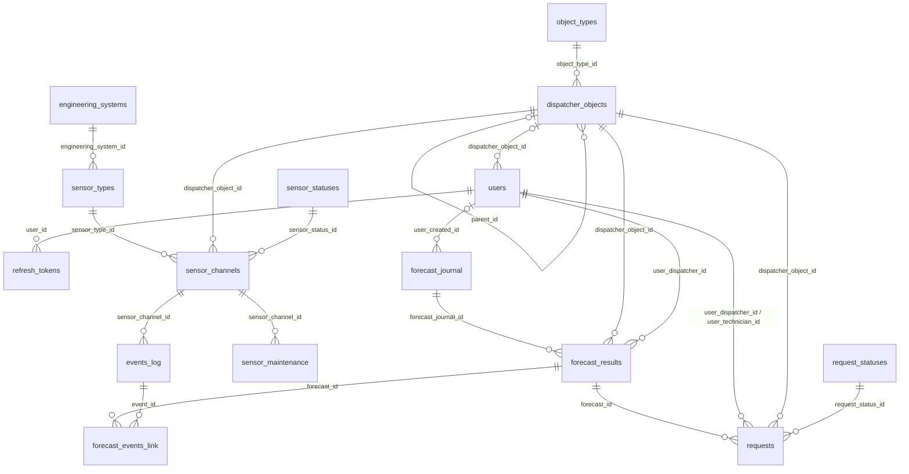

# Схема базы данных `app_db`

Документ описывает структуру, получаемую после успешного применения SQL-файлов из `postgres-db/migrations/app_db` в лексикографическом порядке. Он объединяет изменения из разных миграций в одно описание конечной схемы. Источник структуры — SQL-миграции; ограничения применения `021` описаны ниже.

> Это описание схемы репозитория, а не снимок конкретного окружения. В самой базе могут быть дополнительные ручные изменения или иные данные справочников. Дата подготовки: 2026-09-27.

## Содержание

- [Обзор и группы таблиц](#обзор-и-группы-таблиц)
- [Связи между таблицами](#связи-между-таблицами)
- [Служебные таблицы миграций](#служебные-таблицы-миграций)
- [Аутентификация](#аутентификация)
- [Справочники датчиков и журнал событий](#справочники-датчиков-и-журнал-событий)
- [Прогнозы и история прогнозирования](#прогнозы-и-история-прогнозирования)
- [Заявки](#заявки)
- [Тревоги и обслуживание датчиков](#тревоги-и-обслуживание-датчиков)
- [ML-брокер](#ml-брокер)
- [Индексы, функции и триггеры](#индексы-функции-и-триггеры)
- [Начальные данные и сидирование](#начальные-данные-и-сидирование)
- [История изменений схемы](#история-изменений-схемы)
- [Эксплуатационные замечания](#эксплуатационные-замечания)

## Обзор и группы таблиц

База `app_db` используется несколькими подсистемами. Таблицы не всегда связаны внешними ключами: в частности, `alarms` и таблицы ML-брокера остаются отдельным контуром, а некоторые соответствия идентификаторов задаются на уровне приложения.

| Группа | Таблицы | Назначение |
|---|---|---|
| Служебные | `app_metadata`, `__schema_migrations` | Метаданные приложения и учёт применённых миграций |
| Идентификация | `users`, `refresh_tokens` | Локальные учётные записи и ротация refresh-токенов |
| Справочники и события | `engineering_systems`, `sensor_types`, `object_types`, `dispatcher_objects`, `sensor_statuses`, `sensor_channels`, `events_log` | Иерархия объектов, каналы датчиков и поступившие значения |
| Прогнозы и заявки диспетчеризации | `forecast_journal`, `forecast_results`, `forecast_events_link`, `request_statuses`, `requests` | Запуски прогноза, результаты, связи с событиями и заявки |
| Тревоги и обслуживание | `alarms`, `sensor_maintenance` | Срабатывания из LCT-контура и обслуживание каналов |
| ML-брокер | `ml_predict_queue`, `ml_schedule`, `ml_retrain_runs` | Очередь предсказаний, расписания и журнал переобучения |

В перечислении 20 прикладных таблиц; `__schema_migrations` создаётся мигратором отдельно. Миграция `021` удаляет `equipment_channel_map`, `channel_directory`, `maintenance_requests`, `predictions`, `sensor_features` и `equipment`; добавляет `sensor_maintenance`. Внешние ключи и индексы описаны в карточках таблиц ниже.

## Связи между таблицами

`ml_predict_queue.subject_id` и `alarms.sensor_external_id` остаются текстовыми идентификаторами без внешнего ключа к `sensor_channels`. Триггер, ранее связывавший `sensor_features` с очередью, удалён вместе с таблицей `sensor_features`.

## Служебные таблицы миграций

### `app_metadata`

Хранит небольшие пары ключ-значение, в частности начальную версию схемы приложения.

| Колонка | Тип | NULL | По умолчанию / ограничения | Значение |
|---|---|---:|---|---|
| `key` | `text` | нет | первичный ключ | Ключ метаданных |
| `value` | `text` | нет | — | Текстовое значение |
| `updated_at` | `timestamptz` | нет | `now()` | Время изменения; автоматическое обновление при `UPDATE` не задано |

Миграция `001_initialize.sql` добавляет строку `schema_version = '1'`, только если такого ключа ещё нет. Других операций с этой таблицей в рассматриваемых миграциях нет.

### `__schema_migrations`

Создаётся `Shared.DatabaseMigration.PostgresMigrator` при запуске миграций и хранит по одной строке на применённый SQL-файл.

| Колонка | Тип | NULL | По умолчанию / ограничения | Значение |
|---|---|---:|---|---|
| `script_name` | `text` | нет | первичный ключ | Имя применённого файла миграции |
| `applied_at` | `timestamptz` | нет | `now()` | Время записи о применении |

Каждый файл выполняется в транзакции, после чего имя записывается в эту таблицу. Повторно отмеченные файлы пропускаются. Эта таблица не объявлена в миграциях каталога, потому что её создаёт сам мигратор.

## Аутентификация

### `users`

Пользователи приложения. Изначальная миграция добавляла `role`, но миграция `004` удалила эту колонку. Роли и разрешения приложения сейчас задаются кодом/конфигурацией, а не столбцом этой таблицы.

| Колонка | Тип | NULL | Ограничения | Значение |
|---|---|---:|---|---|
| `id` | `uuid` | нет | первичный ключ | Идентификатор пользователя |
| `login` | `varchar(256)` | нет | `users_login_not_blank` | Логин; строка после `btrim` не должна быть пустой |
| `is_active` | `boolean` | нет | — | Признак активности |
| `dispatcher_object_id` | `integer` | да | FK → `dispatcher_objects.id` | Закреплённый диспетчерский объект |

Индексов, кроме индекса первичного ключа, миграции не задают. `login` не уникален на уровне базы.

### `refresh_tokens`

Хранит хеши refresh-токенов и состояние ротации/отзыва. Сам токен в таблице не хранится.

| Колонка | Тип | NULL | По умолчанию / ограничения | Значение |
|---|---|---:|---|---|
| `id` | `uuid` | нет | первичный ключ | Идентификатор записи токена |
| `family_id` | `uuid` | нет | — | Семейство токенов при ротации |
| `user_id` | `uuid` | нет | FK → `users.id` | Владелец |
| `token_hash` | `bytea` | нет | UNIQUE; ровно 32 байта | SHA-256-хеш токена |
| `created_at` | `timestamptz` | нет | — | Создание |
| `expires_at` | `timestamptz` | нет | проверка `expires_at > created_at` | Истечение |
| `consumed_at` | `timestamptz` | да | — | Использование/поглощение при ротации |
| `revoked_at` | `timestamptz` | да | — | Отзыв |

Индексы: `idx_refresh_tokens_family (family_id)`, `idx_refresh_tokens_user (user_id)`. Частичный уникальный индекс `uq_refresh_tokens_active_family (family_id)` действует только для строк, где `consumed_at IS NULL AND revoked_at IS NULL`, поэтому в одном семействе может быть не более одного активного токена.

## Справочники датчиков и журнал событий

### `engineering_systems`

Справочник инженерных систем.

| Колонка | Тип | NULL | Ограничения |
|---|---|---:|---|
| `id` | `integer` | нет | первичный ключ |
| `name` | `text` | нет | UNIQUE |

### `sensor_types`

Справочник типов датчиков, относящих каждый тип к инженерной системе.

| Колонка | Тип | NULL | Ограничения |
|---|---|---:|---|
| `id` | `integer` | нет | первичный ключ |
| `name` | `text` | нет | UNIQUE |
| `engineering_system_id` | `integer` | нет | FK → `engineering_systems.id` |

Отдельный индекс на `engineering_system_id` явно не создаётся.

### `object_types`

Справочник типов объектов диспетчера.

| Колонка | Тип | NULL | Ограничения |
|---|---|---:|---|
| `id` | `integer` | нет | первичный ключ |
| `name` | `text` | нет | UNIQUE |

Начальная загрузка включает значения `district`, `controlHouse`, `guardObject`; это стартовые данные, а не ограниченный CHECK-набор.

### `dispatcher_objects`

Иерархический справочник объектов диспетчеризации. Родитель — другая строка этой же таблицы. После миграции `018` колонка `coordinates` переименована в `latitude`, добавлена `longitude`; обе координаты проверяются в диапазоне WGS 84.

| Колонка | Тип | NULL | По умолчанию / ограничения | Значение |
|---|---|---:|---|---|
| `id` | `integer` | нет | первичный ключ | Идентификатор объекта |
| `hierarchy_level` | `integer` | нет | — | Уровень в иерархии |
| `parent_id` | `integer` | да | FK → `dispatcher_objects.id` | Родительский объект |
| `object_type_id` | `integer` | нет | FK → `object_types.id` | Вид объекта |
| `dispatcher_object_name` | `text` | нет | — | Отображаемое имя; не уникально после миграции `015` |
| `latitude` | `double precision` | нет | CHECK `-90 <= latitude <= 90` | Широта |
| `longitude` | `double precision` | нет | CHECK `-180 <= longitude <= 180` | Долгота |

Индексы: `idx_dispatcher_objects_parent (parent_id)`, `idx_dispatcher_objects_type (object_type_id)`. При миграции `018` существующие значения заменяются детерминированными тестовыми координатами района Москвы; их следует считать тестовым заполнением до замены реальными координатами.

### `sensor_statuses`

Справочник текущих статусов каналов датчиков.

| Колонка | Тип | NULL | Ограничения |
|---|---|---:|---|
| `id` | `integer` | нет | первичный ключ |
| `name` | `text` | нет | UNIQUE |

Значения загружаются миграцией `016_1`; миграция `019` добавляет `Нет связи`, если имя ещё не занято. Автоматического назначения ID при добавлении статуса нет: миграция выбирает `MAX(id) + 1`.

### `sensor_channels`

Канал/сигнал датчика, привязанный к объекту, типу датчика и текущему статусу.

| Колонка | Тип | NULL | Ограничения |
|---|---|---:|---|
| `id` | `integer` | нет | первичный ключ |
| `sensor_type_id` | `integer` | нет | FK → `sensor_types.id` |
| `sensor_name` | `text` | нет | Отображаемое имя, не уникально после `015` |
| `dispatcher_object_id` | `integer` | нет | FK → `dispatcher_objects.id` |
| `sensor_status_id` | `integer` | нет | FK → `sensor_statuses.id` |
| `loaded_at` | `timestamptz` | нет | DEFAULT `now()`; добавлена миграцией `021` |

Индексы: `idx_sensor_channels_type (sensor_type_id)`, `idx_sensor_channels_object (dispatcher_object_id)`, `idx_sensor_channels_status (sensor_status_id)`. В отличие от версии схемы сразу после миграции `006`, имена каналов могут повторяться.

### `events_log`

Журнал измерений/событий от каналов. Первичный ключ — исходный ID события; генератора ID нет. `event_datetime` после `009` имеет тип `timestamptz`; исходное значение при конвертации трактуется как UTC.

| Колонка | Тип | NULL | Ограничения | Значение |
|---|---|---:|---|---|
| `id` | `bigint` | нет | первичный ключ | ID события во внешнем источнике |
| `sensor_channel_id` | `integer` | нет | FK → `sensor_channels.id` | Канал-источник |
| `event_datetime` | `timestamptz` | нет | — | Время события с часовым поясом |
| `is_alarm` | `boolean` | нет | — | Является ли событие тревожным |
| `sensor_value` | `text` | да | — | Текстовое показание |

Индексы: `idx_events_log_channel (sensor_channel_id)`, `idx_events_log_datetime (event_datetime)`, `idx_events_log_alarm (is_alarm)`, а также `idx_events_log_channel_time_id (sensor_channel_id, event_datetime DESC, id DESC)`. Последний поддерживает получение последнего ненулевого показания канала с детерминированным разрешением одинакового времени через ID события.

## Прогнозы и история прогнозирования

### `forecast_journal`

Одна запись на запуск формирования прогноза. После `019` снимок содержит карту последних текстовых показаний по каналам. Ключи JSON-объекта — ID канала (в виде JSON-ключа-строки), значения — `sensor_value`. Пример: `{"123":"42.1","124":"норма"}`.

| Колонка | Тип | NULL | По умолчанию / ограничения | Значение |
|---|---|---:|---|---|
| `id` | `uuid` | нет | PK; `gen_random_uuid()` | ID запуска |
| `description` | `text` | нет | — | Описание запуска |
| `user_created_id` | `uuid` | да | FK → `users.id` | Автор; NULL для автозапуска |
| `forecast_channels` | `jsonb` | нет | CHECK `jsonb_typeof(...) = 'object'` | Снимок последних показаний каналов |
| `creation_time` | `timestamp` | нет | — | Время создания; хранится без часового пояса |
| `start_composition_time` | `timestamp` | да | — | Начало расчёта |
| `end_composition_time` | `timestamp` | да | — | Завершение расчёта |
| `run_type` | `text` | нет | DEFAULT `'manual'`; CHECK `manual` или `auto` | Тип запуска |
| `scheduled_hour` | `timestamptz` | да | — | Плановый час для автоматического запуска |
| `params` | `json` | да | — | Параметры запуска; структура JSON не ограничена |
| `status` | `text` | да | — | Статус запуска; набор значений БД не ограничивает |

Проверка `forecast_journal_origin_chk` связывает тип запуска и источник: `manual` требует `user_created_id IS NOT NULL` и `scheduled_hour IS NULL`; `auto` требует `user_created_id IS NULL` и `scheduled_hour IS NOT NULL`. FK автора имеет стандартное поведение удаления/обновления (NO ACTION). Индекс `idx_forecast_journal_creator (user_created_id)`. Частичный уникальный индекс `uq_forecast_journal_auto_hour (scheduled_hour) WHERE run_type = 'auto'` не позволяет записать более одного автоматического журнала на один час.

Миграция `019` переименовывает `forecast_objects` и принудительно заменяет содержимое всех старых строк на `{}`: достоверный старый снимок каналов восстановить было нельзя. Это намеренное уничтожение старого JSON-содержимого.

### `forecast_results`

Результат/объект прогноза внутри запуска.

| Колонка | Тип | NULL | По умолчанию / ограничения | Значение |
|---|---|---:|---|---|
| `id` | `uuid` | нет | PK; `gen_random_uuid()` | ID результата |
| `forecast_journal_id` | `uuid` | нет | FK → `forecast_journal.id` | Запуск-владелец |
| `forecast_name` | `text` | нет | — | Имя прогноза |
| `forecast_description` | `jsonb` | нет | — | Структурированное описание |
| `dispatcher_object_id` | `integer` | нет | FK → `dispatcher_objects.id` | Объект прогноза |
| `user_dispatcher_id` | `uuid` | нет | FK → `users.id` | Диспетчер |
| `is_erroneous` | `boolean` | нет | — | Признак ошибочного результата |
| `is_cancelled` | `boolean` | нет | — | Признак отмены |

Индексы: `idx_forecast_results_journal (forecast_journal_id)`, `idx_forecast_results_object (dispatcher_object_id)`, `idx_forecast_results_dispatcher (user_dispatcher_id)`.

### `forecast_events_link`

Связующая таблица многие-ко-многим между результатами прогноза и событиями.

| Колонка | Тип | NULL | Ограничения |
|---|---|---:|---|
| `forecast_id` | `uuid` | нет | Часть составного PK; FK → `forecast_results.id` |
| `event_id` | `bigint` | нет | Часть составного PK; FK → `events_log.id` |

Составной PK `pk__forecast_events_link__forecast_id__event_id` запрещает дублировать пару. Дополнительные индексы: `idx_forecast_events_link_forecast (forecast_id)` и `idx_forecast_events_link_event (event_id)`; индекс по `forecast_id` частично дублирует левый префикс PK, но создан миграцией явно.

## Заявки

### `request_statuses`

Справочник статусов заявок.

| Колонка | Тип | NULL | По умолчанию / ограничения |
|---|---|---:|---|
| `id` | `uuid` | нет | PK; `gen_random_uuid()` |
| `name` | `text` | нет | UNIQUE |

Миграция `017` добавляет статус `Новая` с фиксированным ID `00000000-0000-0000-0000-000000000001`.

### `requests`

Диспетчерская заявка, связанная с прогнозом, объектом, двумя пользователями и статусом.

| Колонка | Тип | NULL | По умолчанию / ограничения | Значение |
|---|---|---:|---|---|
| `id` | `uuid` | нет | PK; `gen_random_uuid()` | ID заявки |
| `forecast_id` | `uuid` | нет | FK → `forecast_results.id` | Основание заявки |
| `request_description` | `text` | нет | — | Описание заявки |
| `user_dispatcher_id` | `uuid` | нет | FK → `users.id` | Создавший диспетчер |
| `user_technician_id` | `uuid` | нет | FK → `users.id` | Назначенный техник |
| `dispatcher_object_id` | `integer` | нет | FK → `dispatcher_objects.id` | Объект заявки |
| `execution_description` | `text` | нет | — | Описание выполнения; даже до выполнения поле обязательно |
| `request_status_id` | `uuid` | нет | FK → `request_statuses.id` | Статус |
| `priority` | `integer` | да | — | Приоритет; DEFAULT не задан |
| `created_at` | `timestamptz` | нет | DEFAULT `now()` | Время добавления колонки или создания новой заявки |
| `updated_at` | `timestamptz` | нет | DEFAULT `now()` | Время добавления колонки или создания новой заявки; автоматического обновления при `UPDATE` нет |

Несмотря на комментарий в старом DDL «может быть NULL» у `forecast_id`, колонка объявлена `NOT NULL`. Индексы: `idx_requests_forecast (forecast_id)`, `idx_requests_dispatcher (user_dispatcher_id)`, `idx_requests_technician (user_technician_id)`, `idx_requests_object (dispatcher_object_id)`, `idx_requests_status (request_status_id)`.

## Тревоги и обслуживание датчиков

### `alarms`

События тревоги/срабатывания из LCT-контура.

| Колонка | Тип | NULL | По умолчанию / ограничения |
|---|---|---:|---|
| `id` | `uuid` | нет | PK; `gen_random_uuid()` |
| `sensor_external_id` | `text` | нет | — |
| `occurred_at` | `timestamptz` | нет | — |
| `alarm_type` | `text` | нет | Комментарий перечисляет `contact`, `volume`, `temperature`, `smoke`, `gas`; CHECK нет |
| `address` | `text` | да | — |
| `verification_result` | `text` | да | Комментарий перечисляет `true_alarm`, `false_alarm`, `pending`; CHECK нет |
| `raw_event` | `jsonb` | да | — |

Индексы: `idx_alarms_sensor_time (sensor_external_id, occurred_at)`, `idx_alarms_occurred_at (occurred_at)`.

### `sensor_maintenance`

Записи об обслуживании каналов датчиков, добавленные миграцией `021`.

| Колонка | Тип | NULL | По умолчанию / ограничения |
|---|---|---:|---|
| `id` | `uuid` | нет | PK; `gen_random_uuid()` |
| `sensor_channel_id` | `integer` | нет | FK → `sensor_channels.id` |
| `note` | `text` | нет | — |
| `mapped_at` | `timestamptz` | нет | DEFAULT `now()` |

Отдельного индекса на `sensor_channel_id` миграция не создаёт.

## ML-брокер

### `ml_predict_queue`

Долговечная очередь запросов на предсказание. После удаления `sensor_features` миграцией `021` триггер больше не пополняет её; новые задачи могут появиться только при отдельной записи в таблицу.

| Колонка | Тип | NULL | По умолчанию / ограничения |
|---|---|---:|---|
| `id` | `bigint` (`bigserial`) | нет | PK, последовательность |
| `category` | `text` | нет | Часть UNIQUE; допустимость не ограничена CHECK |
| `subject_id` | `text` | нет | Часть UNIQUE; внешний ключ к `sensor_channels` не задан |
| `as_of` | `timestamptz` | нет | Часть UNIQUE; время входного наблюдения |
| `priority` | `integer` | нет | DEFAULT `0` |
| `status` | `text` | нет | DEFAULT `'pending'`; CHECK: `pending`, `running`, `done`, `failed` |
| `attempts` | `integer` | нет | DEFAULT `0` |
| `error` | `text` | да | Последняя ошибка обработки |
| `created_at` | `timestamptz` | нет | `now()` |
| `claimed_at` | `timestamptz` | да | Время захвата worker-ом |
| `finished_at` | `timestamptz` | да | Время завершения/окончательного отказа |
| `retry_after` | `timestamptz` | да | Раньше этого момента задача повторно не выбирается |

Уникальное ограничение `uq_queue_dedup (category, subject_id, as_of)` не допускает дублирующую задачу. Индекс `idx_queue_status_id (status, id)`.

### `ml_schedule`

Расписание фоновых задач ML-брокера в пятичастном cron-формате.

| Колонка | Тип | NULL | По умолчанию / ограничения |
|---|---|---:|---|
| `id` | `uuid` | нет | PK; `gen_random_uuid()` |
| `kind` | `text` | нет | CHECK: `predict-all` или `retrain` |
| `name` | `text` | нет | UNIQUE |
| `cron_expr` | `text` | нет | Пятичастное cron-выражение |
| `args` | `jsonb` | нет | DEFAULT `{}` |
| `enabled` | `boolean` | нет | DEFAULT `true` |
| `last_run_at` | `timestamptz` | да | — |
| `next_run_at` | `timestamptz` | да | — |
| `created_at` | `timestamptz` | нет | `now()` |

Ограничения: `uq_ml_schedule_name`, `ml_schedule_kind_chk`. Начальные задания: `hourly-predict` (`0 * * * *`) и `daily-retrain` (`30 4 * * *`). Часовой пояс интерпретации cron определяется реализацией scheduler-а/окружением, а не ограничением таблицы.

### `ml_retrain_runs`

Журнал запусков переобучения.

| Колонка | Тип | NULL | По умолчанию / ограничения |
|---|---|---:|---|
| `id` | `uuid` | нет | PK; `gen_random_uuid()` |
| `started_at` | `timestamptz` | нет | `now()` |
| `finished_at` | `timestamptz` | да | — |
| `category` | `text` | да | NULL означает все категории (по комментарию DDL) |
| `status` | `text` | нет | DEFAULT `'running'`; CHECK не задан |
| `metrics` | `jsonb` | да | Метрики запуска |

Индексов, кроме PK, миграции не задают.

## Индексы, функции и триггеры

### `ml_enqueue_from_features()`

`005_ml_broker.sql` создаёт функцию `ml_enqueue_from_features()`, которая ставила задачи в `ml_predict_queue` и отправляла `pg_notify('ml_predict', '1')` после вставки в `sensor_features`. Миграция `021` удаляет `sensor_features` вместе с её триггером `trg_enqueue_features`, но не удаляет саму функцию. В конечной схеме функция остаётся без триггера и с обращением к прежнему полю `NEW.channel_id`; автоматически наполнять очередь ей больше нечего.

### Каталог индексов

Ниже перечислены именованные индексы, сохранившиеся после всех миграций; индексы первичных ключей и UNIQUE создаются PostgreSQL автоматически.

| Индекс | Таблица / ключ | Назначение или условие |
|---|---|---|
| `idx_alarms_sensor_time` | `alarms(sensor_external_id, occurred_at)` | Поиск тревог по датчику и времени |
| `idx_alarms_occurred_at` | `alarms(occurred_at)` | Выборка тревог по времени |
| `idx_refresh_tokens_family` | `refresh_tokens(family_id)` | Чтение семейства токенов |
| `idx_refresh_tokens_user` | `refresh_tokens(user_id)` | Чтение токенов пользователя |
| `uq_refresh_tokens_active_family` | `refresh_tokens(family_id)` UNIQUE partial | Только неиспользованные и неотозванные токены |
| `idx_queue_status_id` | `ml_predict_queue(status, id)` | Выборка очереди по статусу |
| `idx_dispatcher_objects_parent` | `dispatcher_objects(parent_id)` | Дети объекта в иерархии |
| `idx_dispatcher_objects_type` | `dispatcher_objects(object_type_id)` | Объекты по типу |
| `idx_sensor_channels_type` | `sensor_channels(sensor_type_id)` | Каналы по типу датчика |
| `idx_sensor_channels_object` | `sensor_channels(dispatcher_object_id)` | Каналы объекта |
| `idx_sensor_channels_status` | `sensor_channels(sensor_status_id)` | Каналы по статусу |
| `idx_events_log_channel` | `events_log(sensor_channel_id)` | События канала |
| `idx_events_log_datetime` | `events_log(event_datetime)` | События по времени |
| `idx_events_log_alarm` | `events_log(is_alarm)` | Фильтр тревожности |
| `idx_events_log_channel_time_id` | `events_log(sensor_channel_id, event_datetime DESC, id DESC)` | Последнее событие канала |
| `idx_forecast_journal_creator` | `forecast_journal(user_created_id)` | Журналы пользователя; NULL для авто |
| `uq_forecast_journal_auto_hour` | `forecast_journal(scheduled_hour)` UNIQUE partial | Только `run_type = 'auto'` |
| `idx_forecast_results_journal` | `forecast_results(forecast_journal_id)` | Результаты запуска |
| `idx_forecast_results_object` | `forecast_results(dispatcher_object_id)` | Результаты объекта |
| `idx_forecast_results_dispatcher` | `forecast_results(user_dispatcher_id)` | Результаты диспетчера |
| `idx_forecast_events_link_forecast` | `forecast_events_link(forecast_id)` | События результата |
| `idx_forecast_events_link_event` | `forecast_events_link(event_id)` | Обратный поиск результатов |
| `idx_requests_forecast` | `requests(forecast_id)` | Заявки результата |
| `idx_requests_dispatcher` | `requests(user_dispatcher_id)` | Заявки диспетчера |
| `idx_requests_technician` | `requests(user_technician_id)` | Заявки техника |
| `idx_requests_object` | `requests(dispatcher_object_id)` | Заявки объекта |
| `idx_requests_status` | `requests(request_status_id)` | Заявки статуса |

Также действуют UNIQUE-индексы/ограничения для `ml_schedule.name`, `ml_predict_queue(category, subject_id, as_of)`, `refresh_tokens.token_hash` и уникальных имён справочников (кроме отображаемых имён объектов и каналов, освобождённых миграцией `015`).

## Начальные данные и сидирование

- `001_initialize.sql`: `app_metadata.schema_version = '1'`.
- `005_ml_broker.sql`: два стандартных расписания `hourly-predict` и `daily-retrain`.
- `016_1_add_data_dictionary.sql`: тестовые типы объектов, тестовые объекты/координаты, инженерные системы, типы датчиков и статусы.
- `016_2_add_data_dictionary_channels.sql`: тестовые каналы.
- `017_add_data_dictionary.sql`: статус заявки `Новая`.
- `018_dispatcher_object_coordinates.sql`: перезаписывает координаты загруженных объектов тестовыми координатами Москвы.
- `019_forecast_channels_and_connectivity.sql`: статус `Нет связи`, если его ещё нет.
- `postgres-db/README.md` описывает отдельную загрузку справочников event feeder из CSV командой `python scripts/seed_event_feed_references.py --apply`. Она работает с уже запущенным Compose PostgreSQL, не является миграцией схемы и в README характеризуется как тестовая загрузка.
- Скрипты `scripts/load_channel_directory.py` и `scripts/map_equipment_channels.py`, описанные в `ml-broker/docs/producer.md`, относятся к таблицам, которые удаляет `021`; после этой миграции их прежний контракт с БД неприменим.

Начальные данные не следует путать с ограничениями: например, перечень типов тревог в комментарии к `alarms` не закреплён CHECK-ограничением.

## История изменений схемы

Мигратор сортирует имена файлов лексикографически, применяет каждый файл один раз и записывает его имя в `__schema_migrations`. Файлы выполняются в транзакциях. `postgres-db/init/01-init.sql` лишь создаёт базу `app_db` при первичной инициализации Docker volume; SQL-схему создают миграции app-service.

| Файл | Что меняет в итоговой схеме |
|---|---|
| `001_initialize.sql` | `app_metadata`, начальная версия схемы |
| `002_lct_domain.sql` | `equipment`, `alarms`, `predictions`, `maintenance_requests` и их индексы |
| `003_auth.sql` | `users`, `refresh_tokens`, проверки токена и индексы |
| `004_remove_user_role.sql` | Удаляет `users.role`; в конечной схеме этой колонки нет |
| `005_ml_broker.sql` | ML-признаки, очередь, расписания, журнал retrain, уникальность predictions, триггер/функция, начальные расписания |
| `006_adding_default_tables.sql` | Справочники объектов/датчиков и `events_log` |
| `007_adding_other_tables.sql` | Привязка пользователя к объекту, журналы прогнозов/результаты/связи событий, справочник статусов заявок и `requests` |
| `008_channel_mapping.sql` | `channel_directory`, `equipment_channel_map`, уникальность пары канал/время у `sensor_features` |
| `009_events_log_timestamp_with_time_zone.sql` | `events_log.event_datetime` становится `timestamptz`, исходное время читается как UTC |
| `015_allow_duplicate_dictionary_names.sql` | Удаляет уникальность отображаемых названий объектов и каналов |
| `016_1_add_data_dictionary.sql` | Тестовое наполнение базовых справочников |
| `016_2_add_data_dictionary_channels.sql` | Тестовое наполнение каналов |
| `017_add_data_dictionary.sql` | Добавляет стартовый статус «Новая» |
| `018_dispatcher_object_coordinates.sql` | Переименовывает координату в широту, добавляет долготу и проверки диапазона |
| `019_forecast_channels_and_connectivity.sql` | Обновляет JSON-снимок в журнале, добавляет тип/час запуска, статус отсутствия связи и составной индекс событий |
| `021_Edit_many_tables.sql` | Добавляет `sensor_channels.loaded_at` и `sensor_maintenance`, поля журнала прогнозов и заявок; удаляет шесть таблиц прежнего LCT/ML-контура вместе с их индексами и триггером |

В номерах есть пропуски и два файла с префиксом `016`; это допустимо: порядок фактически определяется полным именем файла, то есть `016_1` раньше `016_2`. Мигратор не использует номер как версию и не требует непрерывной последовательности.

## Эксплуатационные замечания

1. **Временные типы отличаются.** События, даты заявок и ML-данные используют `timestamptz`; `forecast_journal.creation_time`, `start_composition_time`, `end_composition_time` остаются `timestamp without time zone`. Код репозитория трактует их как UTC, но схема сама это не гарантирует.
2. **`019` очищает старые JSON-данные.** При переходе со старой колонки `forecast_objects` все записи получают `{}`. Сохранение прежнего содержимого потребовало бы отдельного бэкапа до миграции.
3. **`requests.forecast_id` обязательна.** Комментарий в исходной миграции допускает NULL, но фактический DDL объявляет колонку `NOT NULL`.
4. **Справочные ID в основном задаются извне.** `engineering_systems`, `sensor_types`, `object_types`, `dispatcher_objects`, `sensor_statuses`, `sensor_channels` используют `integer` без identity/sequence; импортёр должен передавать ID.
5. **Строковые статусы и категории не всегда ограничены БД.** Там, где миграция задала только комментарий, БД принимает любые значения; перечень в комментарии — соглашение приложения.
6. **Поведение удаления по умолчанию — NO ACTION.** Если у FK отдельно не указан `ON DELETE`, родительскую запись нельзя удалить, пока на неё ссылаются строки.
7. **`021` зависит от содержимого базы.** `ALTER TABLE sensor_features ADD COLUMN sensor_channel_id INT NOT NULL` не задаёт DEFAULT и выполняется до `UPDATE`. При наличии строк в `sensor_features` миграция завершится ошибкой до удаления таблиц; описанная здесь конечная схема тогда не будет получена. Если таблица пуста, последующий `UPDATE` ничего не меняет, а таблица в конце удаляется.
8. **`021` удаляет данные шести таблиц.** Это `equipment_channel_map`, `channel_directory`, `maintenance_requests`, `predictions`, `sensor_features` и `equipment`. Мигратор выполняет файл в транзакции, поэтому при ошибке операции этого файла откатываются.
9. **Миграции — не обязательно идемпотентны сами по себе.** README называет запуск миграций идемпотентным благодаря `__schema_migrations`; многие DDL-операции создания таблиц без `IF NOT EXISTS` рассчитаны на запуск только через мигратор.

## Где искать исходные определения

- SQL миграции: [`postgres-db/migrations/app_db`](../migrations/app_db/)
- Инициализация базы: [`postgres-db/init/01-init.sql`](../init/01-init.sql)
- Механизм миграций: [`shared/DatabaseMigration/PostgresMigrator.cs`](../../shared/DatabaseMigration/PostgresMigrator.cs)
- Общие сведения о Postgres: [`postgres-db/README.md`](../README.md)
- Контракт producer-а ML: [`ml-broker/docs/producer.md`](../../ml-broker/docs/producer.md)
